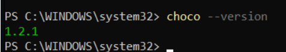
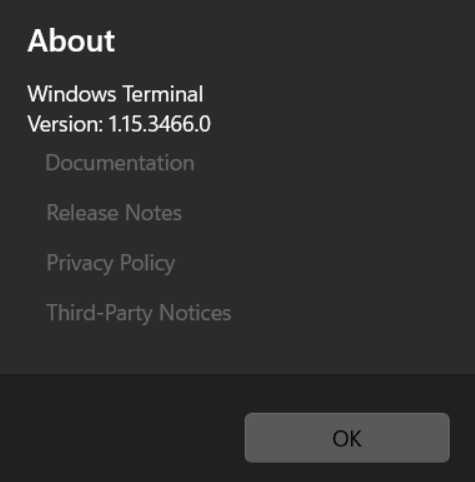
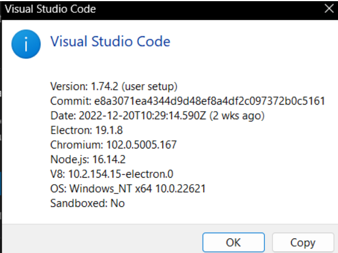
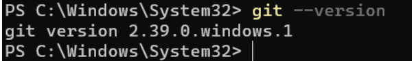
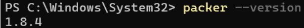
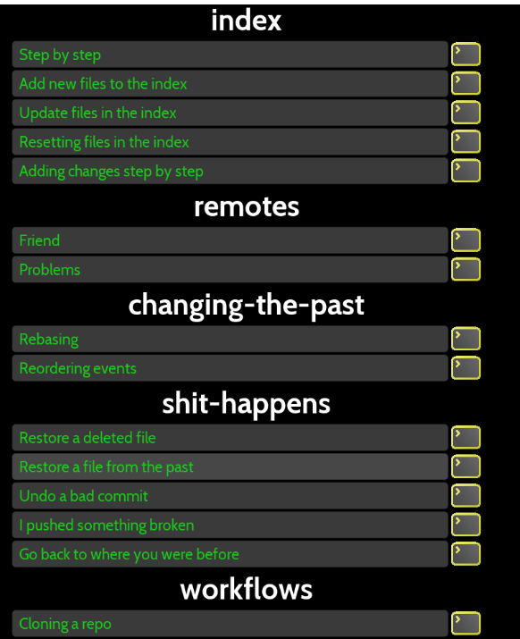
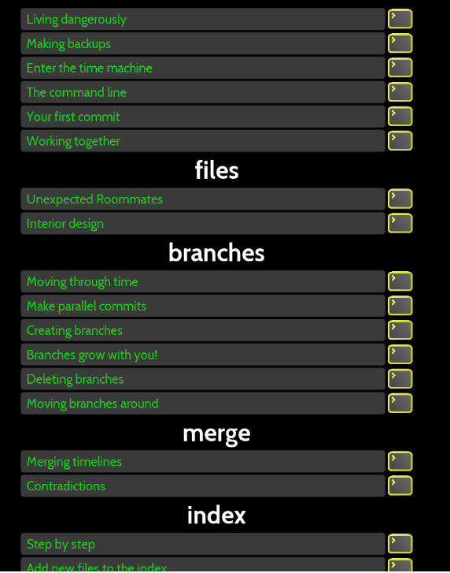
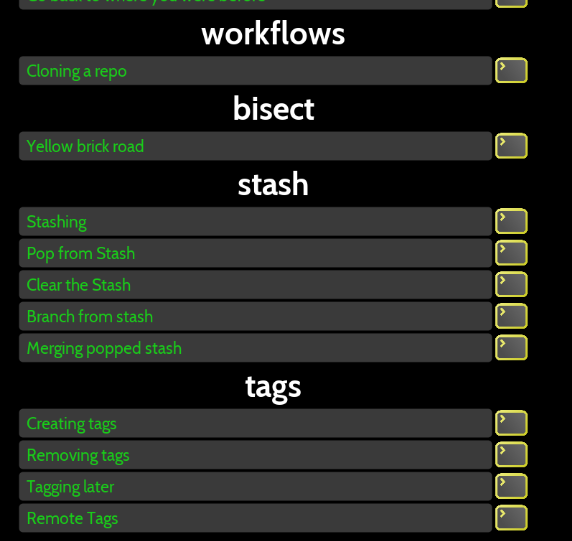

# Tooling Setup Assignment

## Objectives

* Discuss and describe modern Cloud Native tooling
* Learn and describe the advantage using modern package managers on Windows and MacOS for tooling install
* Demonstrate the advantages of using version control for documentation distribution
* Learn and discuss the use of Markdown for text based document creation

## Outcome

At the end of this assignment you will have become familiar with industry standard package managers for Windows and MacOS and be able to install standard tooling used in Cloud Native application development. This will be achieved by following a small demo and some small tutorials.

## Overview

Complete the required installs in this document via a Package Manager and take a screenshot of the proper output to show a successful install. Place the screenshot into the document as mentioned in the last step.

## Tooling Assignment Part I

We will cover the initial installation of tools we will need for this semester.  If you have already completed this in a prior class, you could take the time to update your software or reach out and help a classmate and take a note that there are a few changes.

## Sample Code

Additional samples and tutorials are available at [https://github.com/illinoistech-itm/jhajek/tree/master/itmt-430](https://github.com/illinoistech-itm/jhajek/tree/master/itmt-430 "webpage for samples")

### Package Managers

### Installation of a Modern Shell

### Installation of a Modern Terminal

### Install IDE editor with native version control support

### Install Git Client for Version Control

### Install VirtualBox or Parallels

### Install Vagrant

### Install Packer.io

### Oh-My-Git Tutorial

